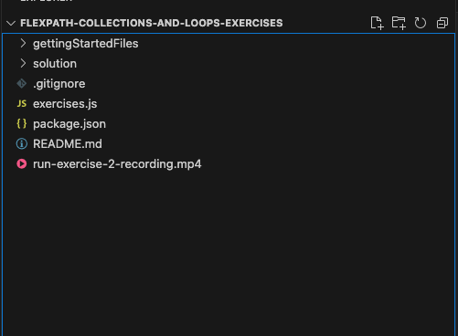
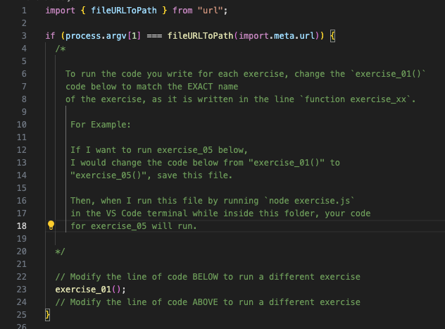

# flexpath-collections-and-loops-exercises

## Exercise overview

The intention of this exercise is to give you more experience working with
collections and loops in JavaScript.

## Getting Started

1. Using Visual Studio Code, open the folder `flexpath-conditional-logic-and-control-flow-exercises` 
   wherever you saved it on your device. 
2. Your VS code file explorer window should look like this:
   
3. Then open up the `exercises.js` file in the `flexpath-conditional-logic-and-control-flow-exercises` folder. 
   Inside of this file we have provided exercises for you to complete, written 
   in code comments. For each exercise, please code ONLY in the space 
   between the comments `// CODE IN THE OPEN LINES BELOW` and `// CODE IN THE OPEN LINES ABOVE` 
4. To run your code for different exercises, you will update the exercise mentioned
   on line 23 of the file. 
   
5. After changing that line, make sure to SAVE the file before running it.
6. To run your code in exercises.js, you will update line 23 to run the exercise code
   you want to run and save the file. THEN, open a Terminal window in VS Code 
   by going to your toolbar at the top of the page and selecting 
   "Terminal" -> "New Terminal"
7. Inside of this terminal, check that you have Node.js installed by running the 
   command `node -v`. If your computer doesn't recognize that keyword, please
   go back and ensure you installed Node.js correctly.
8. To run `exercises.js` you will then use the command `node exercises.js` in the
   terminal to run the file.

We have included the screen recording from exercise 2 showing how to run these
types of exercise files. 

Exercise solutions are in the `/solution` folder

&nbsp;
---

### Summary of JavaScript Concepts Covered in These Exercises

1. **Data Collections**:
    
    - Arrays: Creating, accessing, and manipulating arrays, using methods like `push`, `unshift`, `splice`, and `includes`.
    - Maps: Creating maps with the `Map` constructor, setting and getting values, and handling unique keys, including non-string keys.
    - Sets: Creating sets with the `Set` constructor, adding unique values, and using methods like `has` and `delete`.
2. **Looping Constructs**:
    
    - **While Loop**: Usage and potential pitfalls, like infinite loops.
    - **Do-While Loop**: How it differs from the while loop and when to use it.
    - **For Loop**: Structure and usage for iterating over arrays.
    - **For-Of Loop**: Simplifying iteration over array elements.
    - **For-In Loop**: Iterating over object properties.
    - **Loop Control**: Using `break` and `continue` for controlling loop flow, and understanding labeled statements for nested loops.
3. **Memory Management**:
    
    - Handling primitives and objects in memory.
    - Understanding reference types and how JavaScript manages collections.
